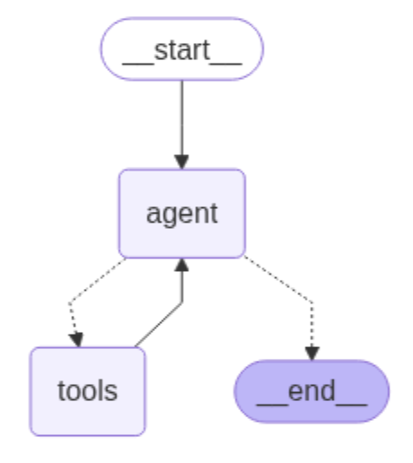
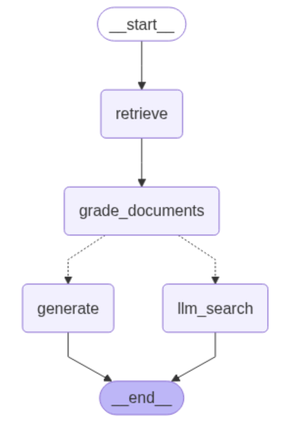

# Overview

Inspired from 

https://langchain-ai.github.io/langgraph/tutorials/workflows/

https://langchain-ai.github.io/langgraph/tutorials/rag/langgraph_agentic_rag/

https://github.com/langchain-ai/langgraph/blob/main/examples/rag/langgraph_self_rag_local.ipynb

https://langchain-ai.github.io/langgraph/tutorials/rag/langgraph_adaptive_rag_local/

We tested 2 approaches to do LLM workflow using langchain/langgraph

1. use tool calling 

2. use agent to automate recognize flow and execute accordingly 

Demo is about to build a stock analysist agent that help people to finacial insights and investment tips for the given stocks

# Install

install pyenv
python version 3.11+

create virtual environment
```
python -m venv .venv
pip install -r requirements.txt
```

install pdf loader related
```
pip install "unstructured[pdf]"
```

install juypter notebook
```
pip install notebook

jupyter notebook
```

## Export requirement

```
pip freeze > requirements.txt
```

# Run

## start a normal workflow
```
python -m stock_analysist_flow_demo
```

## start agent using tools
```
python -m stock_analysist_tools_demo
```